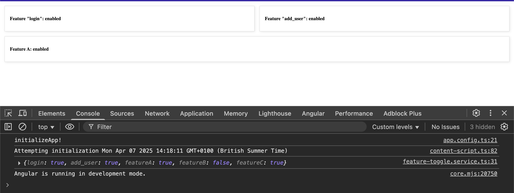
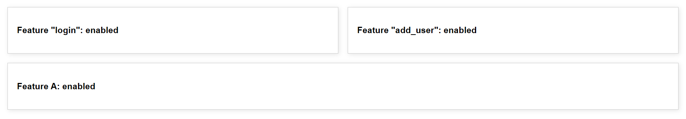
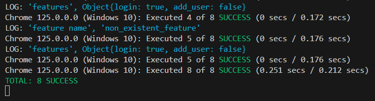
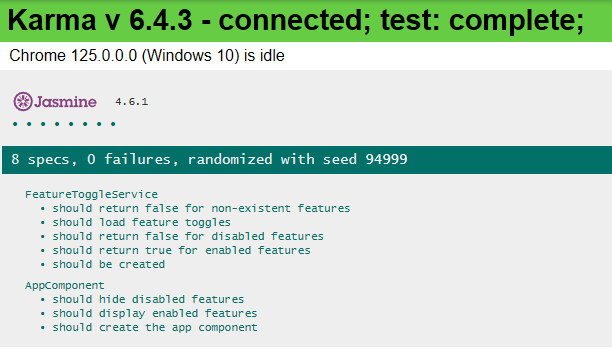

# Angular (19+) Feature Flags 🚩

## Let me explain what this Angular application does. It's a feature flag (also known as feature toggle) implementation that allows you to enable or disable specific features in your application based on configuration settings.

Here's a breakdown of the main components and functionality:
- Feature Toggle Service (FeatureToggleService):
- Loads feature toggle configurations from a JSON file (/assets/feature-toggles.json)
- Provides methods to check if a specific feature is enabled or disabled
- The configuration includes features like:
login
add_user
featureA
featureB

Application Initialisation:
- Uses provideAppInitializer to load feature toggles when the application starts
- This ensures feature flags are available before the app renders
- Uses firstValueFrom to convert the Observable from loadFeatureToggles() into a Promise

Feature Toggle Configuration:
- Looking at the `feature-toggles.json` file:
```js
  {
       "login": true,
       "add_user": true,
       "featureA": true,
       "featureB": false
   }
```

This shows that:
- `login`, `add_user`, and `featureA` features are enabled but `featureB` feature is disabled




---

## Angular Version & Updates

> [ORIGINAL VERSION] Implementing feature toggles in an Angular (17+) application using APP_INITIALIZER is a powerful technique. Feature toggles enable you to conditionally activate or deactivate specific features in your application based on configuration settings. This approach can be particularly useful for deploying features incrementally

> [UPDATED] Update to Angular 19+, The whole point of APP_INITIALIZER (and now provideAppInitializer) is to: Delay app bootstrap until some async setup logic (like fetching config, toggles, auth) completes. Further info: localhost:4200/#/av/cache-test

> [UPDATED RXJS] toPromise() is deprecated in favor of: `firstValueFrom()` (get first emitted value and complete) and `lastValueFrom()` (wait until the observable completes and return last value)

- This behaves exactly like the old `APP_INITIALIZER`:
Angular sees a Promise, so it waits for it to resolve before bootstrapping the app.
You're injecting a service, calling an API, and waiting for the result.
You can chain multiple provideAppInitializer() calls just like multiple APP_INITIALIZERs.


```js
//  don't use APP_INITIALIZER, it is deprecated ❌ use provideAppInitilizer() ✅
// app.config.ts
{
  provide: APP_INITIALIZER,
  useFactory: initializeApp,
  deps: [FeatureToggleService],
  multi: true,
},
// instead use provideAppInitilizer() ✅
provideAppInitializer(() => {
  const featureToggleService = inject(FeatureToggleService);
  console.log('initializeApp!');
  return featureToggleService.loadFeatureToggles();
}),
```


## Demo App



## Unit-test CLI




## Unit-test browser




## APP_INITIALIZER Token

The `APP_INITIALIZER` token in Angular is a `dependency injection token` that allows you to load and initialize configuration information before the application starts. This ensures that necessary configuration data is available throughout the application as soon as it begins execution.

## Using `APP_INITIALIZER` for Feature Toggles

Implementing feature toggles in an Angular application using `APP_INITIALIZER` is a powerful technique. Feature toggles enable you to conditionally activate or deactivate specific features in your application based on configuration settings. This approach can be particularly useful for deploying features incrementally, performing A/B testing, or managing experimental features without the need to redeploy the entire application.

## `APP_INITIALIZER` implementation step-by-step

```js
Steps to Implement Feature Toggles with APP_INITIALIZER
Create a Configuration Service:

This service will be responsible for fetching and storing the configuration data, including feature toggles.
Configure APP_INITIALIZER:

Use APP_INITIALIZER to ensure that the configuration service loads the feature toggles before the application starts.
Use Feature Toggles in Components:

Inject the configuration service into your components and use the feature toggles to conditionally display or hide features.

Now, we can efficiently manage feature toggles in your Angular application, ensuring that features are enabled or disabled based on configuration settings loaded during the app initialization phase.
```

---

## Development server

Run `ng serve` for a dev server. Navigate to `http://localhost:4200/`. The app will automatically reload if you change any of the source files.

## Code scaffolding

Run `ng generate component component-name` to generate a new component. You can also use `ng generate directive|pipe|service|class|guard|interface|enum|module`.

## Build

Run `ng build` to build the project. The build artifacts will be stored in the `dist/` directory. Use the `--prod` flag for a production build.

## Running unit tests

Unit tests are written using Jasmine and executed with Karma.

Run `ng test` to execute the unit tests via [Karma](https://karma-runner.github.io).

## Running end-to-end tests

Run `ng e2e` to execute the end-to-end tests via [Protractor](http://www.protractortest.org/).

## Further help

To get more help on the Angular CLI use `ng help` or go check out the [Angular CLI README](https://github.com/angular/angular-cli/blob/master/README.md).

---

### :100: <i>Thanks!</i>
#### Now, don't be an stranger. Let's stay in touch!

<a href="https://github.com/leolanese" target="_blank" rel="noopener noreferrer">
  
</a>

##### :radio_button: Linkedin: <a href="https://www.linkedin.com/in/leolanese/" target="_blank">LeoLanese</a>
##### :radio_button: Twitter: <a href="https://twitter.com/LeoLanese" target="_blank">@LeoLanese</a>
##### :radio_button: DEV.to: <a href="https://www.dev.to/leolanese" target="_blank">Blog</a>
##### :radio_button: Questions / Suggestion / Recommendation: developer@leolanese.com
